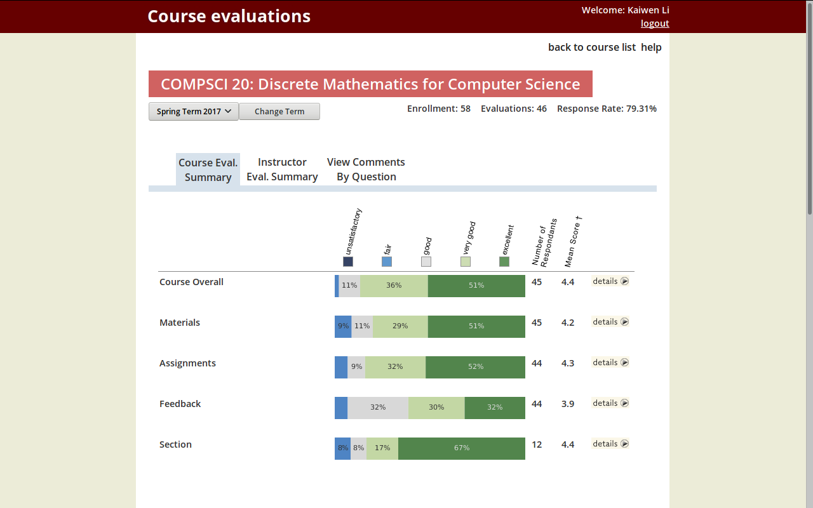

# pastello
Custom userstyle for Harvard's course evaluations site. Changes include a more pastel color palette as well as font changes for increased readability.

## Installation

### Userstyle manager

You'll need a userstyle manager of some sort. Listed below are some possibilities.

- Firefox
  - [Stylus](https://addons.mozilla.org/en-US/firefox/addon/styl-us/)
- Chromium
  - [Stylus](https://chrome.google.com/webstore/detail/stylus/clngdbkpkpeebahjckkjfobafhncgmne/)
- Safari
  - [Stylish](http://sobolev.us/stylish/)

### Font

If you want to use Open Sans, download it [here](https://fonts.google.com/specimen/Open+Sans?selection.family=Open+Sans) and install it. Otherwise it'll default to some other sans-serif fonts.

### Userstyle

[Click here](https://userstyles.org/styles/154206/pastello) to install the userstyle itself.

## Screenshot

